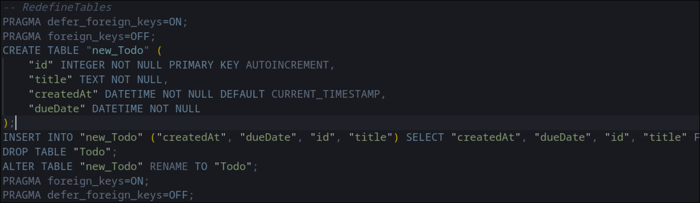
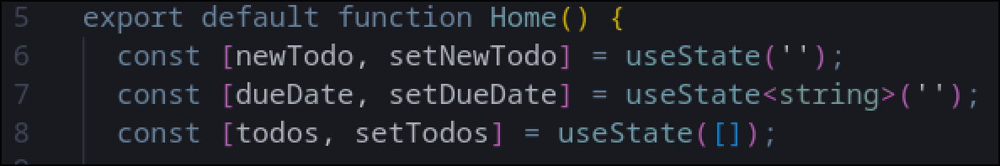
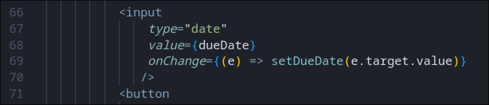
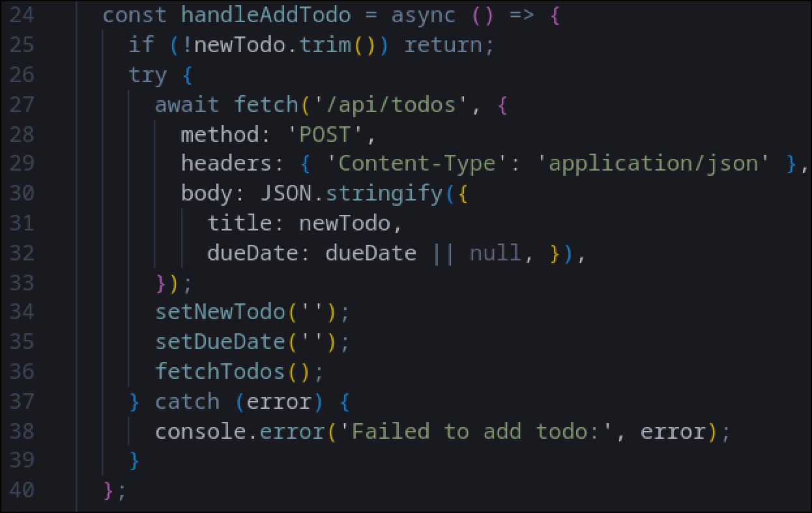
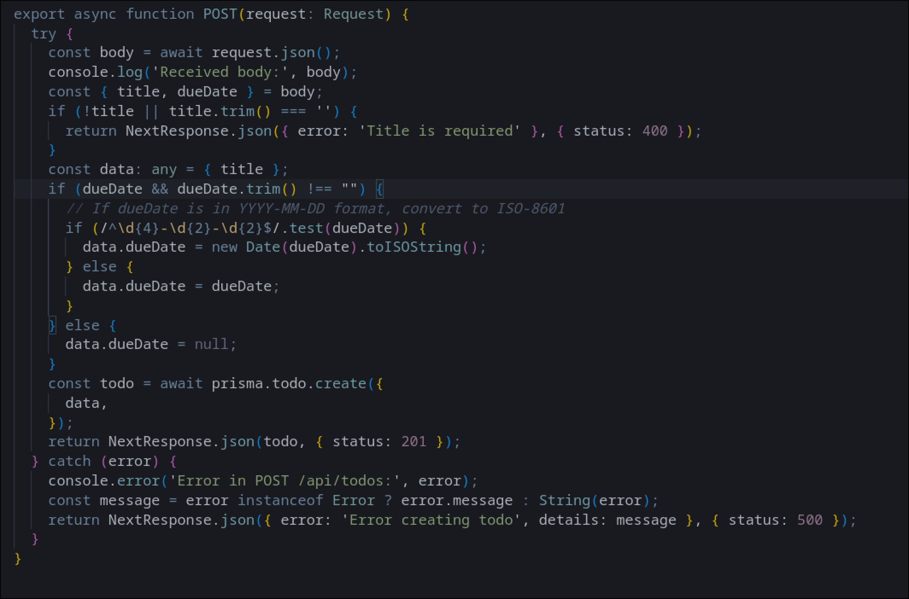
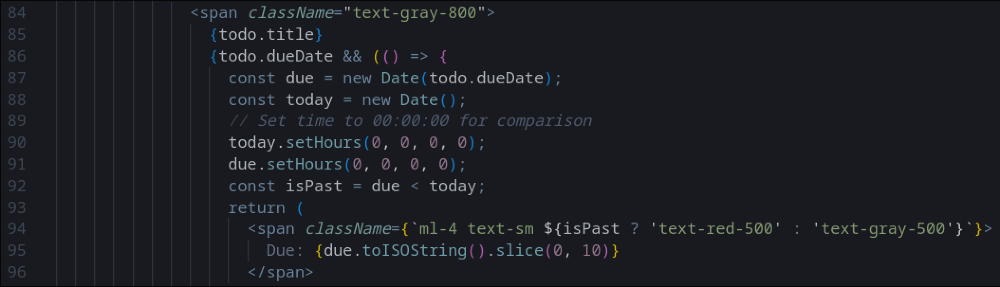

## Soma Capital Technical Assessment

This is a technical assessment as part of the interview process for Soma Capital.

> [!IMPORTANT]  
> You will need a Pexels API key to complete the technical assessment portion of the application. You can sign up for a free API key at https://www.pexels.com/api/  

To begin, clone this repository to your local machine.

## Development

This is a [NextJS](https://nextjs.org) app, with a SQLite based backend, intended to be run with the LTS version of Node.

To run the development server:

```bash
npm i
npm run dev
```

## Task:

Modify the code to add support for due dates, image previews, and task dependencies.

### Part 1: Due Dates 

When a new task is created, users should be able to set a due date.

When showing the task list is shown, it must display the due date, and if the date is past the current time, the due date should be in red.

### Part 2: Image Generation 

When a todo is created, search for and display a relevant image to visualize the task to be done. 

To do this, make a request to the [Pexels API](https://www.pexels.com/api/) using the task description as a search query. Display the returned image to the user within the appropriate todo item. While the image is being loaded, indicate a loading state.

You will need to sign up for a free Pexels API key to make the fetch request. 

### Part 3: Task Dependencies

Implement a task dependency system that allows tasks to depend on other tasks. The system must:

1. Allow tasks to have multiple dependencies
2. Prevent circular dependencies
3. Show the critical path
4. Calculate the earliest possible start date for each task based on its dependencies
5. Visualize the dependency graph

## Submission:

1. Add a new "Solution" section to this README with a description and screenshot or recording of your solution. 
2. Push your changes to a public GitHub repository.
3. Submit a link to your repository in the application form.

Thanks for your time and effort. We'll be in touch soon!

## Solution
The migration that I made redefines the entire Todo table to add a new column: "dueDate." We temporarily diable foreign key operations for a smooth recreation process. It copies all existing data from the old table to the new one, then renames the new table to "Todo." Finally, we re-enable the foreign key constraints and checking. These updates are found in prisma/migrations/20250717181509_add_completed_to_todo/migration.sql:

Next we implement state management at the top of the home page file for storing the new column value. The input fields are controlled be React state, giving us real-time updates and data persistance. We then update the date input component to save the value to the state. These updates are found in app/page.tsx:


Here we are just updating the JSON body to include the dueDate before it is sent to our backend through the HTTP POST request. We also reset the state after. These updates are found in app/page.tsx:

Next, we update the Next.js route handler that processes requests to create new todos. I updated it to extract dueDate form the JSON, and convert dueDate to ISO for the db schema before updating the db. These updates are found in app/api/todos/route.ts:

Finally, the date needs to be displayed! I updated the display to return a processed date from the db so that it is readable. It then checks with the current date, ensuring time of day does not interfere with normalization. Finally it is displayed with dynamic styling to determine if the Todo is to be late! Displaying the ISO string sliced to show down to the day! These updates can be found in app/page.tsx:



