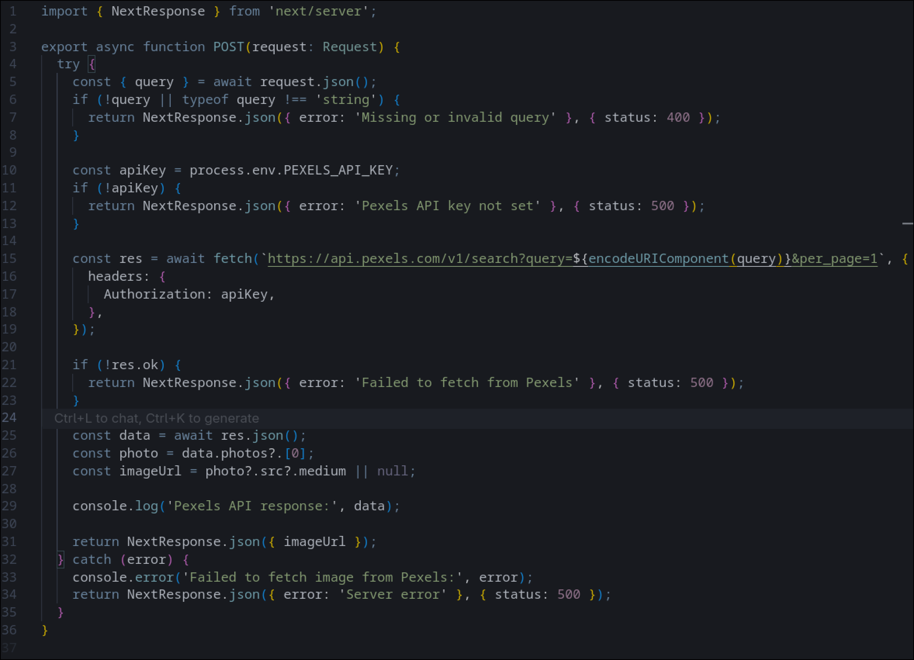
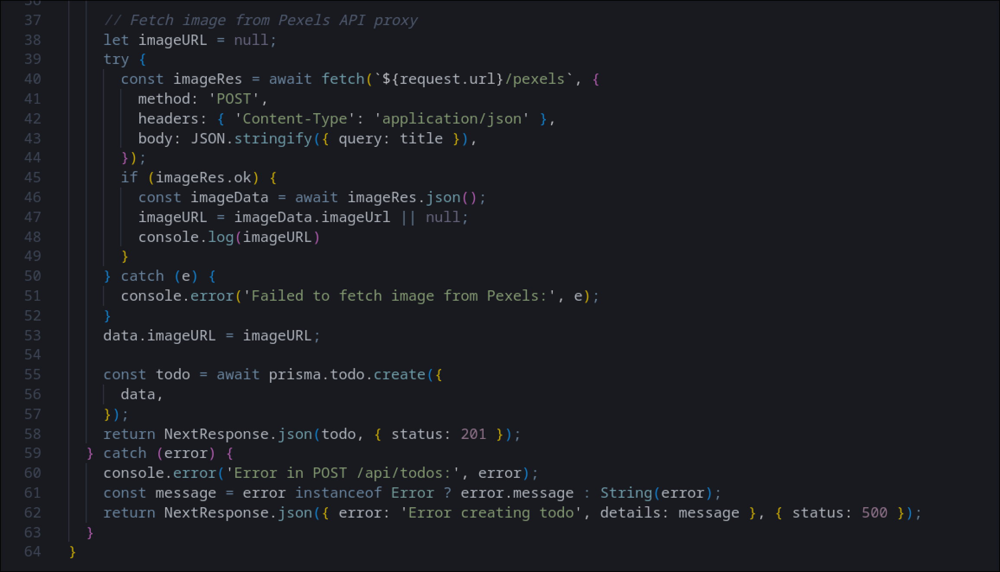
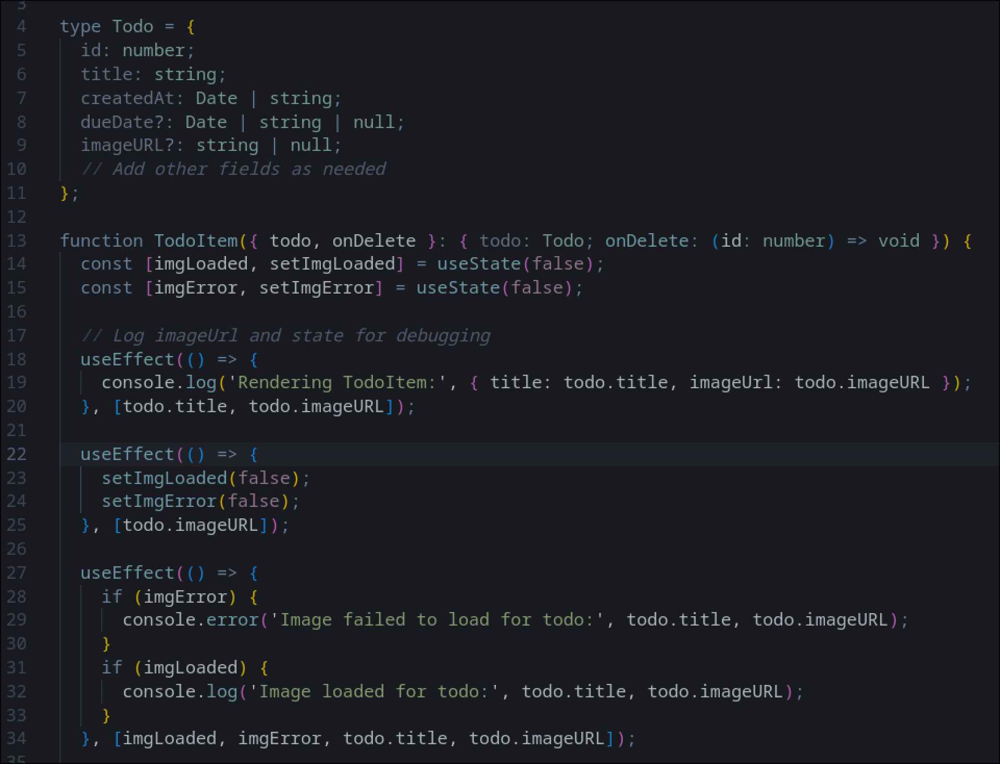
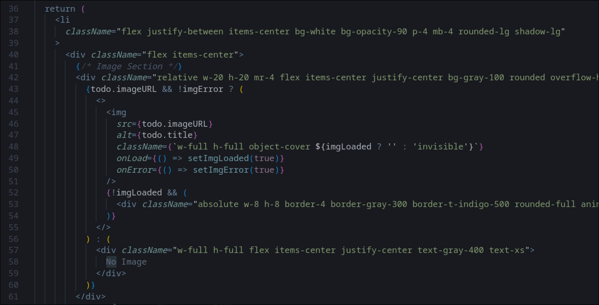
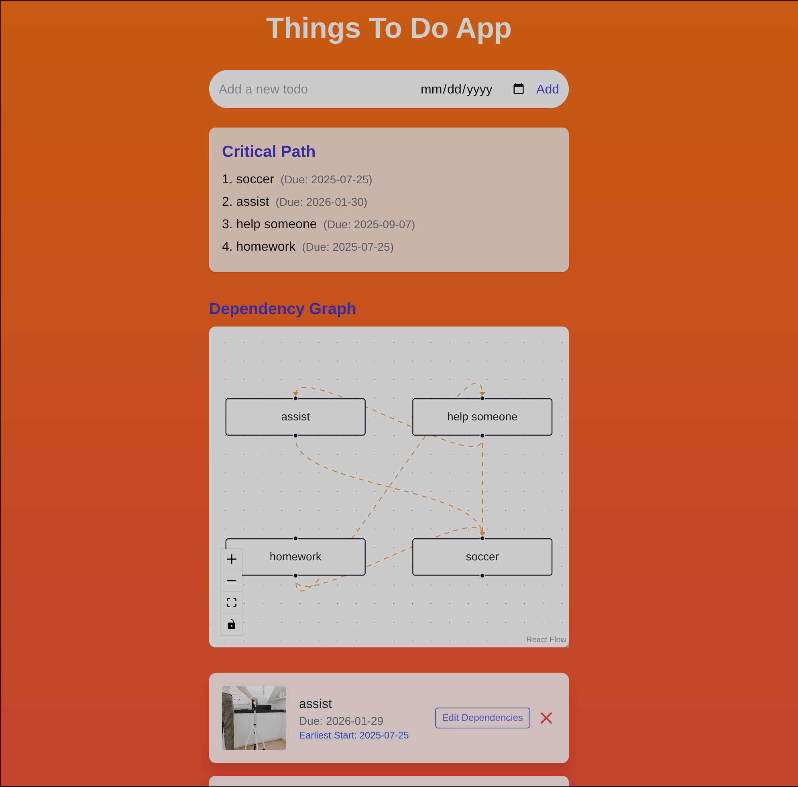
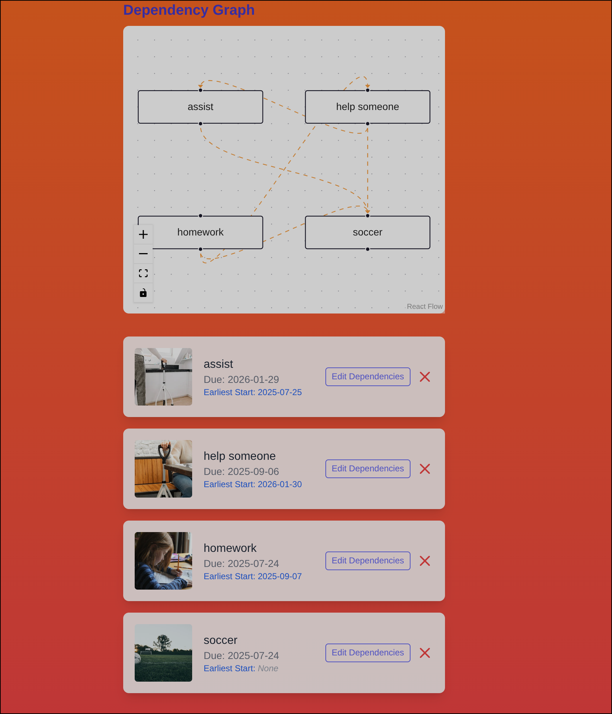
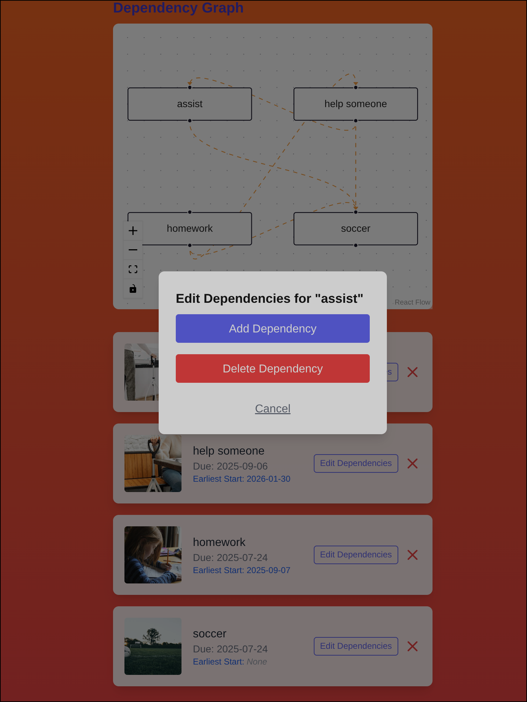
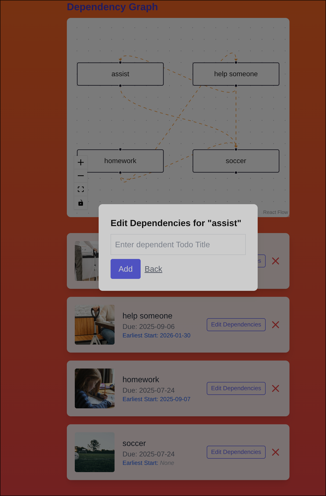
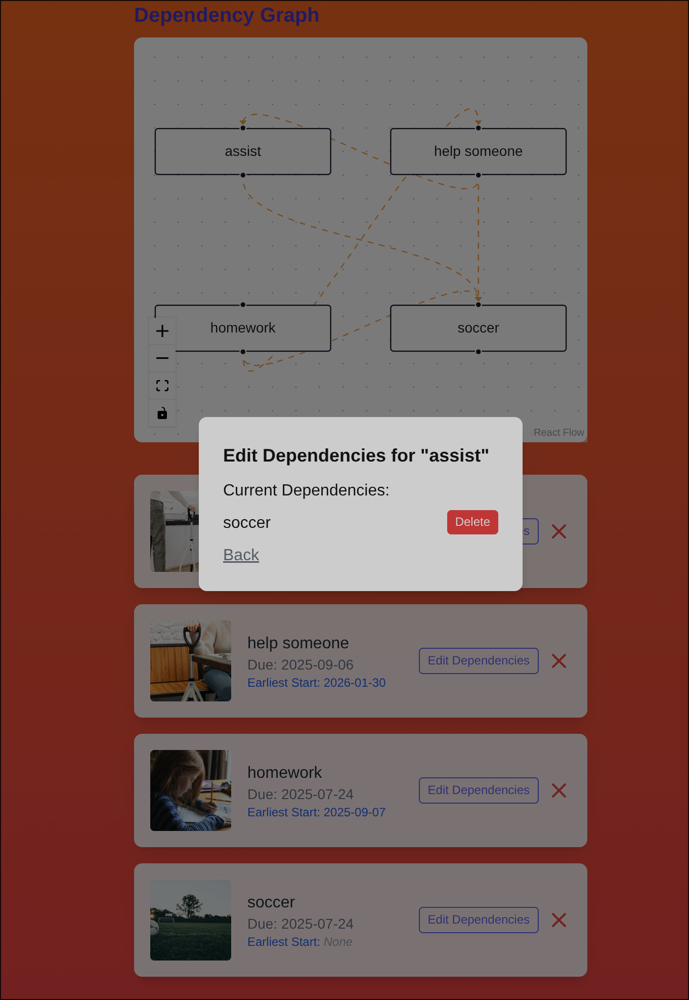

## Soma Capital Technical Assessment

This is a technical assessment as part of the interview process for Soma Capital.

> [!IMPORTANT]  
> You will need a Pexels API key to complete the technical assessment portion of the application. You can sign up for a free API key at https://www.pexels.com/api/  

To begin, clone this repository to your local machine.

## Development

This is a [NextJS](https://nextjs.org) app, with a SQLite based backend, intended to be run with the LTS version of Node.

To run the development server:

```bash
npm i
npm run dev
```

## Task:

Modify the code to add support for due dates, image previews, and task dependencies.

### Part 1: Due Dates 

When a new task is created, users should be able to set a due date.

When showing the task list is shown, it must display the due date, and if the date is past the current time, the due date should be in red.

### Part 2: Image Generation 

When a todo is created, search for and display a relevant image to visualize the task to be done. 

To do this, make a request to the [Pexels API](https://www.pexels.com/api/) using the task description as a search query. Display the returned image to the user within the appropriate todo item. While the image is being loaded, indicate a loading state.

You will need to sign up for a free Pexels API key to make the fetch request. 

### Part 3: Task Dependencies

Implement a task dependency system that allows tasks to depend on other tasks. The system must:

1. Allow tasks to have multiple dependencies
2. Prevent circular dependencies
3. Show the critical path
4. Calculate the earliest possible start date for each task based on its dependencies
5. Visualize the dependency graph

## Submission:

1. Add a new "Solution" section to this README with a description and screenshot or recording of your solution. 
2. Push your changes to a public GitHub repository.
3. Submit a link to your repository in the application form.

Thanks for your time and effort. We'll be in touch soon!

## Solution
### Part 1
The migration that I made redefines the entire Todo table to add a new column: "dueDate." What I did is add the column to schema.prism and then apply the migrations. The migration temporarily diables foreign key operations for a smooth recreation process. It copies all existing data from the old table to the new one, then renames the new table to "Todo." Finally, I re-enable the foreign key constraints and checking. These updates are found in prisma/migrations/20250717181509_add_completed_to_todo/migration.sql:

Next I implement state management at the top of the home page file for storing the new column value. The input fields are controlled be React state, giving us real-time updates and data persistance. I then update the date input component to save the value to the state. These updates are found in app/page.tsx:


Here I am just updating the JSON body to include the dueDate before it is sent to our backend through the HTTP POST request. I also reset the state after. These updates are found in app/page.tsx:

Next, we update the Next.js route handler that processes requests to create new todos. I updated it to extract dueDate form the JSON, and convert dueDate to ISO for the db schema before updating the db. These updates are found in app/api/todos/route.ts:

Finally, the date needs to be displayed! I updated the display to return a processed date from the db so that it is readable. It then checks with the current date, ensuring time of day does not interfere with normalization. Finally it is displayed with dynamic styling to determine if the Todo is to be late! Displaying the ISO string sliced to show down to the day! These updates can be found in app/page.tsx:


### Part 2
The first file defines a post api endpoint acting as a proxy to the Pexels API. The post handler defines a function to handle post requests to this endpoint. Then I extract and validate the query. Next I check for an API key and then call the Pexels API. Finally I handle the API response by extracting the Image URL and I log and respond with JSON format.

Now, when a new todo is created, the backend fetches a Pexels image and saves its URL to the database. 

Then, similar to part 1 I make the migration to add the new column to the database table. From here I must update the code to reflect this. In the todoItem type definition I also add a imageURL field and I update the todoItem react component to display an image(if any) and handle loading state and deletion. I also had to add some logging for debugging as shown in line 17-20(to see if the component rerenders) and lines 27-34(image loading logging). Finally I reset the image state on url change. These updates can be found in app/page.tsx.

Next I have the rendering of the image in each todoItem. If imageURL exists and there is no error it attempts to show the image. While the image is loading, a spinner is shown in the UI. If the image fails to load or there is no imageURL, then a "No Image" placeholder is shown. These updates can be shown in app/page.tsx.


### Part 3
First I need to update out prism scheme and run the migration. I write a new join table to enable self-referencing many to many relationshiop between todos. I add a column for dependencies and dependants that will hold other todos based on their relationships to the current row of todos. These updates can be found in schema.prism.
*insert image 1 here*
When writing the next steps for the dependencies in their route.ts file I had to clean out the stale/corrupted prisma files and regenerate them to fix the Prisma client issues after scheme changes. This got rid of linter errors in the file. First I created the GET handler to fetch dependencies and dependants for a given task, this returns two arrays respectively. I added a POST handler to add a new dependancy for a task, this will validate IDs and prevent any self-dependencies and if valid creates a new TaskDependency record and links the two tasks. A DELETE handler was added to remove dependencies as well. Finally I added a circular dependency prevention function that will check if when adding a dependency if the inverse already exists. I use a DFS to traverse the dependency graph and if it detects a cycle it returns true. All of these changes can be found in api/[id]/dependecies.
*insert images 2 and 3 here*
Next I needed to show the critical path and calculate the earliest start date. I make a new route.ts file for this. I start by defining the TypeScript types for safety and clarity in the code. I then built a function that constructs an in memory graph representation of all tasks and their dependencies where each node contains the todo, a list of dependencies, and a list of dependantss. I then use Kahn's algorithm to perform a topological sort of the nodes(tasks) in the dependency graph, this ensures tasks are processed in dependancy order. Then for each task I calculate the longest path from any root to the task. I track these results in a Map for efficient lookup, mapping task IDs to the earliest start dates and then find the critical path. Finally, a GET handler is added to build the dependency graph and perform the sort, then it returns a JSON response containing the criticalPath and earliestStartDates. These changes can be found in api/[id]/critical-path/route.ts
*insert images 4 6 7 here*


### Application screenshots







